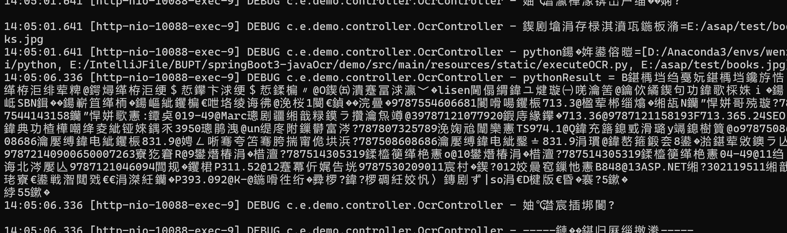

# 项目文档
## 项目功能简介
本项目基于JAVA17+SpringBoot3+Anaconda3制作完成，并支持jar包部署。

功能方面：支持传入一系列要匹配模板关键字，随后对传入的任意图片进行OCR识别，并返回是否匹配到模板以及匹配到的模板名称。

## 参数配置

需要在本地配置一个Python的环境，环境中需要带有CnOCR包。以下是作者的环境包表，可以参考：

```
aiohttp==3.9.0
aiosignal==1.3.1
appdirs==1.4.4
async-timeout==4.0.3
attrs==23.1.0
certifi==2023.11.17
charset-normalizer==3.3.2
click==8.1.7
cnocr==2.2.4.2
cnstd==1.2.3.5
colorama==0.4.6
coloredlogs==15.0.1
contourpy==1.1.1
cycler==0.12.1
docker-pycreds==0.4.0
filelock==3.13.1
flatbuffers==23.5.26
fonttools==4.44.3
frozenlist==1.4.0
fsspec==2023.10.0
gitdb==4.0.11
GitPython==3.1.40
huggingface-hub==0.19.4
humanfriendly==10.0
idna==3.4
importlib-resources==6.1.1
Jinja2==3.1.2
kiwisolver==1.4.5
lightning-utilities==0.10.0
MarkupSafe==2.1.3
matplotlib==3.7.4
mpmath==1.3.0
multidict==6.0.4
networkx==3.1
numpy==1.24.4
onnx==1.15.0
onnxruntime==1.16.1
opencv-python==4.8.1.78
packaging==23.2
pandas==2.0.3
Pillow==10.1.0
Polygon3==3.0.9.1
protobuf==4.25.1
psutil==5.9.6
pyclipper==1.3.0.post5
pyparsing==3.1.1
PyQt5==5.15.10
PyQt5-Qt5==5.15.2
PyQt5-sip==12.13.0
pyreadline3==3.4.1
python-dateutil==2.8.2
pytorch-lightning==2.1.2
pytz==2023.3.post1
PyYAML==6.0.1
requests==2.31.0
scipy==1.10.1
seaborn==0.13.0
sentry-sdk==1.35.0
setproctitle==1.3.3
shapely==2.0.2
six==1.16.0
smmap==5.0.1
sympy==1.12
torch==2.1.1
torchmetrics==1.2.0
torchvision==0.16.1
tqdm==4.66.1
typing_extensions==4.8.0
tzdata==2023.3
Unidecode==1.3.7
urllib3==2.1.0
wandb==0.16.0
yarl==1.9.2
zipp==3.17.0
```

在application.yaml中指定启动的一些参数配置如下：

```yaml
server:
  port: 10087
  servlet:
    encoding:
      charset: UTF-8
      force: true
#下部分为自定义配置
MultipartConfig:
  #要被识别的图片保存地址
  imageLocation: E:/asap/test/
  #带有CnOCR环境的Python解释器路径
  pythonInter: D:/Anaconda3/envs/wenzi/python
  #执行OCR任务的.py文件
  pythonCode: E:/IntelliJFile/BUPT/springBoot3-javaOcr/demo/src/main/resources/static/executeOCR.py
```

MultipartConfig.pythonCode参数所指的ocr文件已经在项目中存储好了，可以直接使用，使用者可以根据自己的参数指定位置：


## 传入传出格式

### part1 模板传入传出

**传入URI**： 

/ocr/template

**传入格式**：

模板传入采用JSON格式字符串传入，具体格式约束如下：

```JSON
[
    {
        "name":"模板名称A",
        "keys":[
            "关键字A1",
            "关键字A2"
        ]
    },
    {
        "name":"模板名称B",
        "keys":[
            "关键字B1",
            "关键字B2",
            "关键字B3"
        ]
    }
    ......
]
```

如上，我们的单个模板需要传入的内容有两个：

- 模板的名称name
  - 此模板仅用于做识别结果的展示，不用来做识别的参考和限制。
- 模板的关键字keys
  - 当且仅当在同一行内同时识别到了这些关键字，才认为我们匹配到了此模板。
  - 此处的“同一行”，是指视觉上的同一行，即一个execl表的一行，或者是一个成绩单中的一行。本质是纵坐标像素点的差距较小的文字。

**返回结果：**

传入成功，则会返回固定的JSON字符串

```JSON
{
    "code": 200,
    "message": "success",
    "data": null
}
```

传输失败，则会返回固定的JSON字符串

```json
{
    "code": 400,
    "message": "failed",
    "data": null
}
```

### part2 图片传入传出

**传入URI**：

/ocr/img

**传入格式：**

图片传入部分采用form-data格式，key为`image`即可。

传入的图片即为待识别的图片。

**返回结果**：

传输图片结束，则代表自动开始了图片检测功能。

如果该图片匹配到了相应的模板*(上面传入的)*，则返回识别到的模板标题和识别时间*(LocalDateTime.now())*

```json
{
    "code": 200,
    "message": "success",
    "data": {
        "templateName": "图书管理系统",
        "matchTime": "2024-03-07T13:41:52.6743061"
    }
}
```

如果没有识别到对应的模板，则会返回失败的固定JSON结果：

```json
{
    "code": 401,
    "message": "cantMatchAnyTemplate",
    "data": null
}
```

**<u>注意：无论识别结果如何，都会销毁传入的识别模板。</u>**

### part3 注意事项

传入阶段分两步，每次要先传入可能会匹配到的模板内容，随后再去调用图片接口传入图片。

每次图片识别结束后，都会将图片和识别模板进行销毁。再次检测需要重新传入图片和模板。

## 如何部署

### 打包

首先使用Maven将项目打成jar包，使用IDEA自带的快捷菜单即可。随后在项目的target文件夹下找到打包好的jar包：demo-0.0.1-SNAPSHOT.jar *（名称随意）*


### 编写自定义参数

在想要执行jar包的同级目录下，编写自定义的application.yaml配置文件；其中可以自定义自己的python编译器地址，ocr文件地址等等。

### 执行jar包

按照以下输入启动jar包：

```sh
java -jar "-Dfile.encoding=utf-8" .\demo-0.0.1-SNAPSHOT.jar --spring.config.location=E:\asap\application.yaml
```

其中`.\demo-0.0.1-SNAPSHOT.jar`即为要运行jar包的路径

 `--spring.config.location=E:\asap\application.yaml`表示自己的配置文件位置

**执行结果**

终端中可能会出现乱码，由此可以打开jar包同级目录生成的log文件夹内的demo.log日志信息。其中记录的与终端中的一致。




### 退出

在终端输入 ctrl+c即可终止。关闭终端效果相同。
